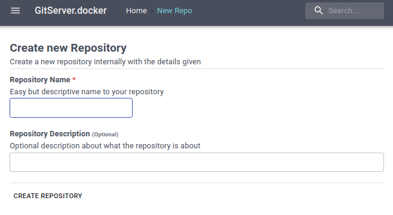
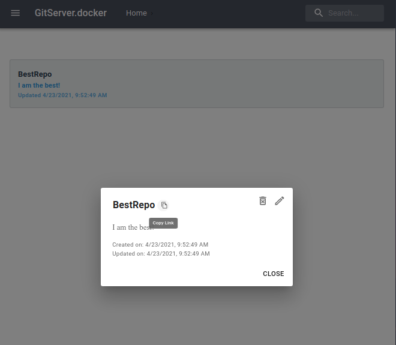

# Git-Server.docker 🐋
Quick, Simple, and Easy Git-Server running in a Docker Container.

## Overview 🎊
The Git Server will run locally, exposed to `Port 80` and `Port 3000` internally. `Port 22` is also exposed for SSH cloning.

## Setup 🔧
Prior to starting the services, configure the [docker-compose.yaml](docker-compose.yaml) file to your liking.

**Most notible Modifications**:
- `WEBADMIN_PASS`: For both **git-web** and **git-server**. The webadmin Encrypted Password
- `SERVER_PASS`: For **git-server**. The webadmin Encrypted Password
- Change the `MONGODB_URL` to match your Local IP Address wtih the MongoDB Credentials if changed

**IMPORTANT**: In order to generate an encrypted password hash, run `openssl passwd -salt xyz -6 123`, with your own `hash (xyz)` and `password (123)`. Paste with result into the [docker-compose.yaml](docker-compose.yaml) file with an additional '$' for every '$', like the example demonstrates.

## Build & Run 📦
`Docker-Compose` is required to get started.
```bash
docker-compose up
```

## Usage 🚀

**View / Add Repository**

In order to view or add a new repository, go to `localhost:8080` on your favorite browser.

**Add Repository**
Go to the side panel then click on `Create New Repo`. Then proceed to fill in the repository information.

</img>


**Cloning Repository**
After creating a repository, click on your repository entry in the home page then click on the Copy Link icon.

</img>

Then you're off! Clone using `git clone` with `git` as the user. The **password** is the generated password for the `git` user given by the variable `WEBADMIN_PASS`. The default password is **123**.
```sh
git clone git@localhost:BestRepo.git
```

---
### License
Licensed under the [MIT License](LICENSE).
